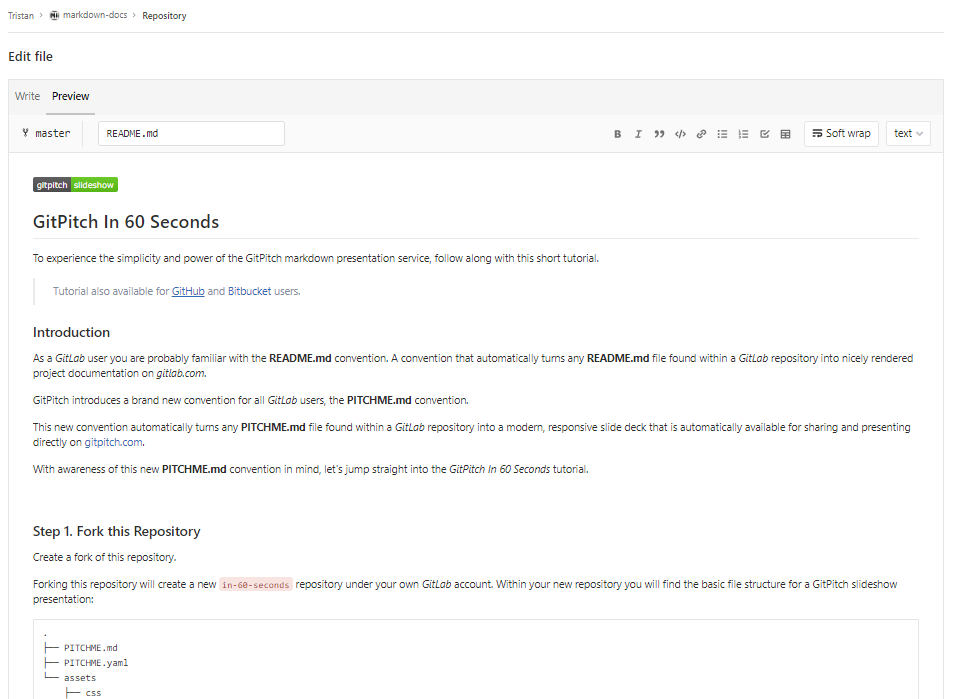

# Markdown Introduction

---
@snap[midpoint span-90 text-07]
## What is Markdown?

* A plain text format for writing structured documents
* Based on conventions for indicating format in email and usenet posts
* Its design allows it to be converted to many output formats, but the original tool by the same name only supports HTML.

---
@snap[midpoint span-70 text-05]
## Where did it come from?


* John Gruber created the Markdown language in 2004 in collaboration with Aaron Swartz on the syntax
* The goal was to enable people "to write using an easy-to-read and easy-to-write plain text format".
* In the next decade, dozens of implementations were developed in many languages. Some extended the original Markdown syntax with:
    * Footnotes
    * Tables
    * Graphs & more
* Some allowed Markdown documents to be rendered in formats other than HTML.

---
@snap[midpoint span-70 text-05]
## Who uses it today?

Websites like Reddit, StackOverflow, GitHub and millions of people use Markdown. Markdown has now moved beyond the web to books, articles, slide shows, letters, and lecture notes and more!

---
@snap[midpoint span-70 text-05]s
## What makes Markdown special?

What distinguishes Markdown from many other lightweight markup syntaxes, which are often easier to write, is its readability. As Gruber writes:

@quote[The overriding design goal for Markdown’s formatting syntax is to make it as readable as possible. The idea is that a Markdown-formatted document should be publishable as-is, as plain text, without looking like it’s been marked up with tags or formatting instructions.]

---
@snap[midpoint span-70 text-05]
## The different flavours

* [CommonMark](https://spec.commonmark.org/0.29/) - Foundation for most markdown flavours
    * [Cheatsheet](https://commonmark.org/help/)
    * [Spec](https://spec.commonmark.org/0.29/)
* [GitHub Flavoured Markdown](https://github.github.com/gfm/) (Built on CommonMark)
    * [Cheatsheet](https://help.github.com/en/articles/basic-writing-and-formatting-syntax)
    * [Spec](https://github.github.com/gfm/)
* [GitLab Flavoured Markdown](https://docs.gitlab.com/ee/user/markdown.html#gitlab-flavored-markdown-gfm) (Built on CommonMark & inspired by GitHub Flavoured Markdown)
    * [Cheatsheet](https://gitlab.com/help/user/markdown)
    * [Spec](https://docs.gitlab.com/ee/user/markdown.html)
* [Here](https://github.com/commonmark/commonmark-spec/wiki/markdown-flavors) is a long list of Markdown flavours

---
@snap[midpoint span-75 text-05]
## In your IDE
### Sublime Text


---
@snap[midpoint span-70 text-05]
## In your IDE
### VS Code


---
@snap[midpoint span-70 text-05]
## In your Browser
### Editing On GitLab


---
@snap[midpoint span-70 text-05]
## In your Browser
### Preview On GitLab


---
@snap[midpoint span-70 text-05]
## In your browser
### On StackEdit


---
## Using Markdown

---
@snap[midpoint span-70 text-05]
## Emphasis

There are multiple ways to emphasize text in markdown. You can _italicize_, **bold**, ~~strikethrough~~, as well as ~~**_combine these emphasis styles together_**~~.
Examples:
```markdown
Italics, with *asterisks* or _underscores_.
```
Italics, with *asterisks* or _underscores_.
```markdown
Bold, with double **asterisks** or __underscores__.
```
Bold, with double **asterisks** or __underscores__.
```markdown
Strikethrough uses two tildes. ~~Scratch this~~.
```
Strikethrough uses two tildes. ~~Scratch this~~.
```markdown
Combined emphasis with **asterisks and _underscores_**.
```
Combined emphasis with **asterisks and _underscores_**.

---
@snap[midpoint span-80 text-05]
## Blockquotes

Blockquotes are an easy way to highlight information, such as a side-note. It is generated by starting the lines of the blockquote with "`>`"
Example:
```markdown
> This is what it looks like to use **blockquotes**.
```
> This is what it looks like to use **blockquotes**.
Quote break.
> This is a very long line that will still be quoted properly when it wraps. Oh boy let's keep writing to make sure this is long enough to actually wrap for everyone. Oh, you can put **Markdown** into a blockquote.

---
@snap[midpoint span-80 text-05]
## Code spans and blocks

You can easily highlight anything that should be viewed as code and not simple text.
A whole block of code can be fenced with triple backticks ```` ``` ````,
triple tildes (`~~~`), or indended 4 or more spaces to achieve a similar effect for a larger body of code.
```python
def function():
    #indenting works just fine in the fenced code block
    s = "Python code"
    print s
```


---
@snap[midpoint span-70 text-05]
### Headers

# H1
## H2
### H3
#### H4
##### H5
###### H6

Underline-ish style:

Line Below
------


---
@snap[midpoint span-70 text-05]
### Horizontal Rule

It's very simple to create a horizontal rule, by using three or more hyphens, asterisks,
or underscores:

```markdown
Three or more hyphens,

---

asterisks,

***

or underscores

___
```

### Images

Examples:

```markdown
Inline-style (hover to see title text):


Reference-style (hover to see title text):

![alt text1][logo]

[logo]: img/markdown_logo.png "Title Text"
```

Inline-style (hover to see title text):


Reference-style (hover to see title text):

![alt text][logo]

[logo]: img/markdown_logo.png "Title Text"

#### Videos

> If this is not rendered correctly, [view it in GitLab itself](https://gitlab.com/gitlab-org/gitlab/blob/master/doc/user/markdown.md#videos).

Image tags that link to files with a video extension are automatically converted to
a video player. The valid video extensions are `.mp4`, `.m4v`, `.mov`, `.webm`, and `.ogv`:

```md
Here's a sample video:


```

Here's a sample video:


#### Audio

> If this is not rendered correctly, [view it in GitLab itself](https://gitlab.com/gitlab-org/gitlab/blob/master/doc/user/markdown.md#audio).

Similar to videos, link tags for files with an audio extension are automatically converted to
an audio player. The valid audio extensions are `.mp3`, `.ogg`, and `.wav`:

```md
Here's a sample audio clip:


```

Here's a sample audio clip:


### Inline HTML

> To see the markdown rendered within HTML in the second example, [view it in GitLab itself](https://gitlab.com/gitlab-org/gitlab/blob/master/doc/user/markdown.md#inline-html).

You can also use raw HTML in your Markdown, and it'll usually work pretty well.

See the documentation for HTML::Pipeline's [SanitizationFilter](https://www.rubydoc.info/gems/html-pipeline/1.11.0/HTML/Pipeline/SanitizationFilter#WHITELIST-constant)
class for the list of allowed HTML tags and attributes.  In addition to the default
`SanitizationFilter` whitelist, GitLab allows `span`, `abbr`, `details` and `summary` elements.

```html
<dl>
  <dt>Definition list</dt>
  <dd>Is something people use sometimes.</dd>

  <dt>Markdown in HTML</dt>
  <dd>Does *not* work **very** well. HTML <em>tags</em> will <b>always</b> work.</dd>
</dl>
```

<dl>
  <dt>Definition list</dt>
  <dd>Is something people use sometimes.</dd>

  <dt>Markdown in HTML</dt>
  <dd>Does *not* work **very** well. HTML <em>tags</em> will <b>always</b> work.</dd>
</dl>

---

It is still possible to use markdown inside HTML tags, but only if the lines containing markdown
are separated into their own lines:

```html
<dl>
  <dt>Markdown in HTML</dt>
  <dd>Does *not* work **very** well. HTML tags will always work.</dd>

  <dt>Markdown in HTML</dt>
  <dd>

  Does *not* work **very** well. HTML tags will always work.

  </dd>
</dl>
```

<!-- Note: The example below uses HTML to force correct rendering on docs.gitlab.com, markdown will be fine in GitLab -->

<dl>
  <dt>Markdown in HTML</dt>
  <dd>Does *not* work **very** well. HTML tags will always work.</dd>

  <dt>Markdown in HTML</dt>
  <dd>

  Does <em>not</em> work <b>very</b> well. HTML tags will always work.

  </dd>
</dl>

#### Details and Summary

> To see the markdown rendered within HTML in the second example, [view it in GitLab itself](https://gitlab.com/gitlab-org/gitlab/blob/master/doc/user/markdown.md#details-and-summary).

Content can be collapsed using HTML's [`<details>`](https://developer.mozilla.org/en-US/docs/Web/HTML/Element/details)
and [`<summary>`](https://developer.mozilla.org/en-US/docs/Web/HTML/Element/summary)
tags. This is especially useful for collapsing long logs so they take up less screen space.

```html
<p>
<details>
<summary>Click me to collapse/fold.</summary>

These details <em>will</em> remain <strong>hidden</strong> until expanded.

<pre><code>PASTE LOGS HERE</code></pre>

</details>
</p>
```

<p>
<details>
<summary>Click me to collapse/fold.</summary>

These details <em>will</em> remain <strong>hidden</strong> until expanded.

<pre><code>PASTE LOGS HERE</code></pre>

</details>
</p>

---

Markdown inside these tags is supported as well, as long as you have a blank line
after the `</summary>` tag and before the `</details>` tag, as shown in the example:

````html
<details>
<summary>Click me to collapse/fold.</summary>

These details _will_ remain **hidden** until expanded.

```
PASTE LOGS HERE
```

</details>
````

<!-- Note: The example below uses HTML to force correct rendering on docs.gitlab.com, markdown will be fine in GitLab -->

<details>
<summary>Click me to collapse/fold.</summary>

These details <em>will</em> remain <b>hidden</b> until expanded.

<pre><code>PASTE LOGS HERE</code></pre>

</details>

### Line Breaks

A line break will be inserted (a new paragraph will start) if the previous text is
ended with two newlines, i.e. you hit <kbd>Enter</kbd> twice in a row. If you only
use one newline (hit <kbd>Enter</kbd> once), the next sentence will be part of the
same paragraph. This is useful if you want to keep long lines from wrapping, and keep
them easily editable:

```markdown
Here's a line for us to start with.

This longer line is separated from the one above by two newlines, so it will be a *separate paragraph*.

This line is also a separate paragraph, but...
These lines are only separated by single newlines,
so they *do not break* and just follow the previous lines
in the *same paragraph*.
```

Here's a line for us to start with.

This longer line is separated from the one above by two newlines, so it will be a *separate paragraph*.

This line is also a separate paragraph, but...
These lines are only separated by single newlines,
so they *do not break* and just follow the previous lines
in the *same paragraph*.

#### Newlines

GFM adheres to the markdown specification in how [paragraphs and line breaks are handled](https://spec.commonmark.org/current/).

A paragraph is simply one or more consecutive lines of text, separated by one or
more blank lines (i.e. two newlines at the end of the first paragraph), as [explained above](#line-breaks).

If you need more control over line-breaks or soft returns, you can add a single line-break
by ending a line with a backslash, or two or more spaces. Two newlines in a row will create a new
paragraph, with a blank line in between:

```markdown
First paragraph.
Another line in the same paragraph.
A third line in the same paragraph, but this time ending with two spaces.{space}{space}
A new line directly under the first paragraph.

Second paragraph.
Another line, this time ending with a backslash.\
A new line due to the previous backslash.
```

<!-- (Do *NOT* remove the two ending whitespaces in the third line) -->
<!-- (They are needed for the Markdown text to render correctly) -->

First paragraph.
Another line in the same paragraph.
A third line in the same paragraph, but this time ending with two spaces.  
A new line directly under the first paragraph.

<!-- (Do *NOT* remove the two ending whitespaces in the second line) -->
<!-- (They are needed for the Markdown text to render correctly on docs.gitlab.com, the backslash works fine inside GitLab itself) -->

Second paragraph.
Another line, this time ending with a backslash.  
A new line due to the previous backslash.

### Links

There are two ways to create links, inline-style and reference-style:

```md
- This is an [inline-style link](https://www.google.com)
- This is a [link to a repository file in the same directory](index.md)
- This is a [relative link to a readme one directory higher](../README.md)
- This is a [link that also has title text](https://www.google.com "This link takes you to Google!")

Using header ID anchors:

- This links to [a section on a different markdown page, using a "#" and the header ID](index.md#overview)
- This links to [a different section on the same page, using a "#" and the header ID](#header-ids-and-links)

Using references:

- This is a [reference-style link, see below][Arbitrary case-insensitive reference text]
- You can [use numbers for reference-style link definitions, see below][1]
- Or leave it empty and use the [link text itself][], see below.

Some text to show that the reference links can follow later.

[arbitrary case-insensitive reference text]: https://www.mozilla.org/en-US/
[1]: https://slashdot.org
[link text itself]: https://www.reddit.com
```

- This is an [inline-style link](https://www.google.com)
- This is a [link to a repository file in the same directory](index.md)
- This is a [relative link to a readme one directory higher](../README.md)
- This is a [link that also has title text](https://www.google.com "This link takes you to Google!")

Using header ID anchors:

- This links to [a section on a different markdown page, using a "#" and the header ID](index.md#overview)
- This links to [a different section on the same page, using a "#" and the header ID](#header-ids-and-links)

Using references:

- This is a [reference-style link, see below][Arbitrary case-insensitive reference text]
- You can [use numbers for reference-style link definitions, see below][1]
- Or leave it empty and use the [link text itself][], see below.

Some text to show that the reference links can follow later.

[arbitrary case-insensitive reference text]: https://www.mozilla.org/en-US/
[1]: https://slashdot.org
[link text itself]: https://www.reddit.com

NOTE: **Note:** Relative links do not allow the referencing of project files in a wiki
page, or a wiki page in a project file. The reason for this is that a wiki is always
in a separate Git repository in GitLab. For example, `[I'm a reference-style link](style)`
will point the link to `wikis/style` only when the link is inside of a wiki markdown file.

#### URL auto-linking

GFM will autolink almost any URL you put into your text:

```markdown
- https://www.google.com
- https://www.google.com
- ftp://ftp.us.debian.org/debian/
- smb://foo/bar/baz
- irc://irc.freenode.net/
- http://localhost:3000
```

- <https://www.google.com>
- <https://www.google.com>
- <ftp://ftp.us.debian.org/debian/>
- <smb://foo/bar/baz>
- <irc://irc.freenode.net/>
- <http://localhost:3000>

### Lists

Ordered and unordered lists can be easily created.

For an ordered list, add the number you want the list
to start with, like `1.`, followed by a space, at the start of each line for ordered lists.
After the first number, it does not matter what number you use, ordered lists will be
numbered automatically by vertical order, so repeating `1.` for all items in the
same list is common. If you start with a number other than `1.`, it will use that as the first
number, and count up from there.

Examples:

```md
1. First ordered list item
2. Another item
   - Unordered sub-list.
1. Actual numbers don't matter, just that it's a number
   1. Ordered sub-list
   1. Next ordered sub-list item
4. And another item.
```

<!-- The "2." and "4." in the example above are changed to "1." below, to match the style standards on docs.gitlab.com -->
<!-- See https://docs.gitlab.com/ee/development/documentation/styleguide.html#lists -->

1. First ordered list item
1. Another item
   - Unordered sub-list.
1. Actual numbers don't matter, just that it's a number
   1. Ordered sub-list
   1. Next ordered sub-list item
1. And another item.

For an unordered list, add a `-`, `*` or `+`, followed by a space, at the start of
each line for unordered lists, but you should not use a mix of them.

```md
Unordered lists can:

- use
- minuses

They can also:

* use
* asterisks

They can even:

+ use
+ pluses
```

<!-- The "*" and "+" in the example above are changed to "-" below, to match the style standards on docs.gitlab.com -->
<!-- See https://docs.gitlab.com/ee/development/documentation/styleguide.html#lists -->

Unordered lists can:

- use
- minuses

They can also:

- use
- asterisks

They can even:

- use
- pluses

---

If a list item contains multiple paragraphs, each subsequent paragraph should be indented
to the same level as the start of the list item text.

Example:

```markdown
1. First ordered list item

   Second paragraph of first item.

1. Another item
```

1. First ordered list item

   Second paragraph of first item.

1. Another item

---

If the paragraph of the first item is not indented with the proper number of spaces,
the paragraph will appear outside the list, instead of properly indented under the list item.

Example:

```
1. First ordered list item

  Paragraph of first item.

1. Another item
```

1. First ordered list item

  Paragraph of first item.

1. Another item

### Superscripts / Subscripts

CommonMark and GFM currently do not support the superscript syntax ( `x^2` ) that
Redcarpet does. You can use the standard HTML syntax for superscripts and subscripts:

```html
The formula for water is H<sub>2</sub>O
while the equation for the theory of relativity is E = mc<sup>2</sup>.
```

The formula for water is H<sub>2</sub>O
while the equation for the theory of relativity is E = mc<sup>2</sup>.

### Tables

Tables aren't part of the core Markdown spec, but they are part of GFM.

1. The first line contains the headers, separated by "pipes" (`|`).
1. The second line separates the headers from the cells, and must contain three or more dashes.
1. The third, and any following lines, contain the cell values.
   - You **can't** have cells separated over many lines in the markdown, they must be kept to single lines,
     but they can be very long. You can also include HTML `<br>` tags to force newlines if needed.
   - The cell sizes **don't** have to match each other. They are flexible, but must be separated
     by pipes (`|`).
   - You **can** have blank cells.

Example:

```markdown
| header 1 | header 2 | header 3 |
| ---      |  ------  |---------:|
| cell 1   | cell 2   | cell 3   |
| cell 4 | cell 5 is longer | cell 6 is much longer than the others, but that's ok. It will eventually wrap the text when the cell is too large for the display size. |
| cell 7   |          | cell <br> 9 |
```

| header 1 | header 2 | header 3 |
| ---      |  ------  |---------:|
| cell 1   | cell 2   | cell 3   |
| cell 4 | cell 5 is longer | cell 6 is much longer than the others, but that's ok. It will eventually wrap the text when the cell is too large for the display size. |
| cell 7   |          | cell <br> 9 |

Additionally, you can choose the alignment of text within columns by adding colons (`:`)
to the sides of the "dash" lines in the second row. This will affect every cell in the column.

> Note that the headers are always right aligned [within GitLab itself](https://gitlab.com/gitlab-org/gitlab/blob/master/doc/user/markdown.md#tables).

```markdown
| Left Aligned | Centered | Right Aligned | Left Aligned | Centered | Right Aligned |
| :---         | :---:    | ---:          | :----------- | :------: | ------------: |
| Cell 1       | Cell 2   | Cell 3        | Cell 4       | Cell 5   | Cell 6        |
| Cell 7       | Cell 8   | Cell 9        | Cell 10      | Cell 11  | Cell 12       |
```

| Left Aligned | Centered | Right Aligned | Left Aligned | Centered | Right Aligned |
| :---         | :---:    | ---:          | :----------- | :------: | ------------: |
| Cell 1       | Cell 2   | Cell 3        | Cell 4       | Cell 5   | Cell 6        |
| Cell 7       | Cell 8   | Cell 9        | Cell 10      | Cell 11  | Cell 12       |

## References

- This document leveraged heavily from the [Markdown-Cheatsheet](https://github.com/adam-p/markdown-here/wiki/Markdown-Cheatsheet).
- The original [Markdown Syntax Guide](https://daringfireball.net/projects/markdown/syntax)
  at Daring Fireball is an excellent resource for a detailed explanation of standard markdown.
- The detailed specification for CommonMark can be found in the [CommonMark Spec](https://spec.commonmark.org/current/)
- The [CommonMark Dingus](http://try.commonmark.org) is a handy tool for testing CommonMark syntax.


---
@title[Introduction]
## Sources
https://github.github.com/gfm/
https://en.wikipedia.org/wiki/Markdown
https://en.wikipedia.org/wiki/John_Gruber